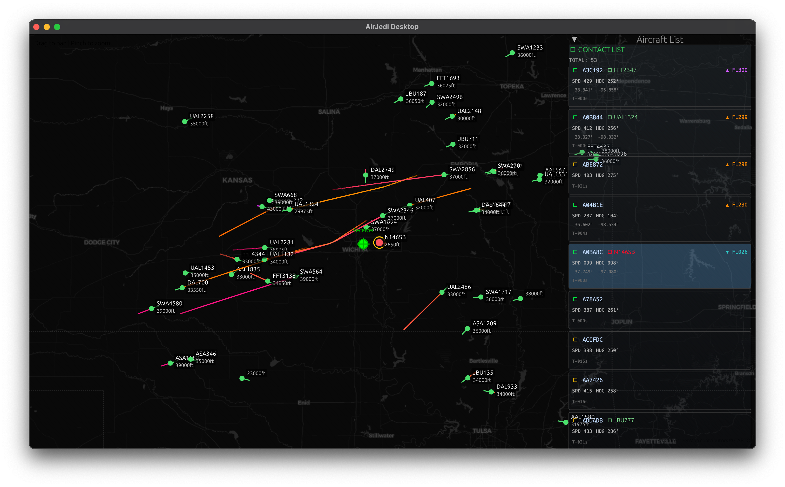

<div align="center">

# ✈️ AirJedi Desktop

**Real-time ADS-B Aircraft Tracking with Beautiful Visualization**

[](LICENSE)
[](https://www.rust-lang.org)
[](https://github.com/ccustine/airjedi-desktop)

This is currently a personal project to explore the use of AI development tools to develop and build highly performant and efficient message processing from SDR and other wireless or digital sensors. This sub-project is a native desktop application for tracking aircraft in real-time using ADS-B data. Built with Rust 🦀 and egui for maximum performance and multiplatform deployment.



[Features](#-features) • [Quick Start](#-quick-start) • [Configuration](#-configuration) • [Architecture](#-architecture) • [License](#-license)

</div>

---

## ✨ Features

### 🗺️ **Interactive Map Visualization**
- **Live Carto Map Tiles** with Web Mercator projection
- **Smooth pan & zoom** controls with trackpad gesture support
- **Smart tile caching** (7-day local cache for instant loading)
- **Auto-centering** on your GPS location at startup

### 🛩️ **Real-time Aircraft Tracking**
- Connects to BaseStation protocol feeds (port 30003)
- Automatic reconnection and error recovery
- Tracks ICAO address, callsign, position, altitude, speed, and heading
- **400-mile radius filtering** for relevant aircraft only
- **Intelligent jump detection** to filter out GPS errors

### 🎨 **Altitude-Based Flight Trails**
Beautiful color-coded flight paths showing the last 10 minutes of history:

| Altitude | Color | Typical Aircraft |
|----------|-------|------------------|
| 0-10k ft | 🔵 Cyan/Teal | General Aviation |
| 10-20k ft | 🟢 Green/Yellow | Regional Jets |
| 20-30k ft | 🟡 Yellow/Orange | Climbing/Descending |
| 30-40k ft | 🟠 Orange/Red | Cruise Altitude |
| 40k+ ft | 🟣 Purple/Magenta | High-Altitude Jets |

Trails smoothly fade from solid to transparent over time, giving you both altitude and recency information at a glance.

### 📊 **Aircraft Information Panel**
- **Military-style contact list** sorted by altitude (highest first)
- Real-time status indicators (active ● / recent ● / stale ○)
- Click to select aircraft on map or in list
- Auto-scroll to selected aircraft
- Flight level (FL), speed, heading, and coordinates
- Last-seen timestamps

### 🎯 **Smart Selection System**
- Click aircraft on map or in list to highlight
- Selected aircraft show with red icon and yellow selection ring
- List automatically scrolls to center selected aircraft
- Subtle 10% opacity background highlight in list

---

## 🚀 Quick Start

### Prerequisites
- **Rust** (1.70 or later) - [Install Rust](https://rustup.rs/)
- **ADS-B Data Source** feeding BaseStation protocol to `localhost:30003`
  - Examples: dump1090, readsb, or any Mode S/ADS-B receiver

### Installation

```bash
# Clone the repository
git clone https://github.com/ccustine/airjedi-desktop.git
cd airjedi-desktop

# Build in release mode (optimized)
cargo build --release

# Run the application
cargo run --release
```

The application will:
1. 📍 Detect your GPS location (macOS: CoreLocation, others: IP geolocation)
2. 🗺️ Center the map on your location
3. 🔌 Connect to `localhost:30003` for ADS-B data
4. ✈️ Start tracking aircraft within 400 miles

---

## ⚙️ Configuration

### Change ADS-B Data Source

Edit `src/tcp_client.rs`:

```rust
let address = "localhost:30003";  // Change to your BaseStation feed
```

### Adjust Distance Filter

Edit `src/basestation.rs` in `AircraftTracker::new()`:

```rust
max_distance_miles: 400.0,  // Change radius (in miles)
```

### Modify Trail Duration

Edit `src/main.rs` constants:

```rust
const TRAIL_MAX_AGE_SECONDS: f32 = 600.0;     // 10 minutes total
const TRAIL_SOLID_DURATION_SECONDS: f32 = 300.0;  // First 5 min solid
const TRAIL_FADE_DURATION_SECONDS: f32 = 300.0;   // Last 5 min fade
```

### Platform-Specific: macOS GPS

On macOS, the app uses CoreLocation for accurate GPS positioning. On first run, you'll be prompted to grant location permissions. On other platforms, IP-based geolocation is used automatically.

---

## 🏗️ Architecture

### Project Structure

```
airjedi-desktop/
├── src/
│   ├── main.rs           # UI & rendering (egui framework)
│   ├── basestation.rs    # ADS-B protocol parser & aircraft tracking
│   ├── tcp_client.rs     # Async TCP client with auto-reconnect
│   └── tiles.rs          # Map tile manager with Web Mercator projection
├── assets/
│   └── airjedi1.png      # Application screenshot
├── Cargo.toml            # Dependencies & build config
├── LICENSE               # Apache 2.0 license
└── README.md             # This file
```

### Key Technologies

- **🦀 Rust** - Memory-safe, zero-cost abstractions
- **🎨 egui** - Immediate mode GUI framework (60 FPS rendering)
- **🌐 eframe** - Native windowing and graphics backend
- **⚡ Tokio** - Async runtime for TCP connections
- **🗺️ Web Mercator** - Standard map projection (EPSG:3857)
- **📦 Carto** - Beautiful basemap tiles

### Data Flow

```
┌─────────────────┐
│  ADS-B Receiver │  (dump1090, readsb)
└────────┬────────┘
         │ BaseStation Protocol (TCP :30003)
         ▼
┌─────────────────┐
│   TCP Client    │  (async, auto-reconnect)
└────────┬────────┘
         │ Parse MSG packets
         ▼
┌─────────────────┐
│ Aircraft Tracker│  (position filtering, trail storage)
└────────┬────────┘
         │ Shared state (Arc<Mutex>)
         ▼
┌─────────────────┐
│   UI Renderer   │  (egui @ 500ms updates)
└────────┬────────┘
         │
         ├─► Map tiles (cached from Carto CDN)
         ├─► Aircraft icons & trails
         └─► Information panel
```

---

## 🎮 Controls

| Action | Control |
|--------|---------|
| **Pan map** | Click & drag |
| **Zoom** | Two-finger pinch (trackpad) or scroll wheel |
| **Select aircraft** | Click icon on map or entry in list |
| **Deselect** | Click empty map area |
| **Collapse list** | Click window title bar |

---

## 🔧 Technical Details

### Position Filtering
- **Haversine formula** for accurate great-circle distance
- **Center radius check**: 400-mile default range
- **Jump detection**: Rejects >10 mile position jumps
- **Resolution**: ~100 meter minimum change to record

### Performance Optimizations
- **Trail history**: 10 minutes stored in memory
- **Update rate**: 500ms (2 Hz) UI refresh
- **Cleanup interval**: Every 100 received messages
- **Aircraft timeout**: 3 minutes of inactivity
- **Tile cache**: SHA256-based filesystem cache with subdomain load balancing

### BaseStation Protocol Support

Decodes the following MSG types:

| Type | Description |
|------|-------------|
| MSG,1 | Aircraft identification (callsign) |
| MSG,3 | Airborne position (lat/lon/altitude) |
| MSG,4 | Airborne velocity (speed/heading) |
| MSG,5 | Surveillance altitude |
| MSG,6 | Surveillance position |
| MSG,7 | Air-to-air message |
| MSG,8 | All call reply |

---

## 🛣️ Roadmap

Future enhancements being considered:

- [ ] 📈 Aircraft detail popup with full flight information
- [ ] 🔍 Configurable filters (altitude range, speed, callsign)
- [ ] 💾 Export data to KML/GeoJSON formats
- [ ] 📡 Multiple simultaneous data source support
- [ ] 🌦️ Weather radar overlay integration
- [ ] 🛫 Airport & waypoint markers
- [ ] 🎨 Custom color schemes and themes
- [ ] 📊 Historical playback and recording
- [ ] 🔔 Aircraft alerts and notifications
- [ ] 🌐 Web-based companion app

---

## 🤝 Contributing

Contributions are welcome! This is an early-stage project with lots of room for improvement.

1. Fork the repository
2. Create your feature branch (`git checkout -b feature/amazing-feature`)
3. Commit your changes (`git commit -m 'Add some amazing feature'`)
4. Push to the branch (`git push origin feature/amazing-feature`)
5. Open a Pull Request

---

## 📝 License

Copyright 2025 Chris Custine

Licensed under the Apache License, Version 2.0 (the "License");
you may not use this file except in compliance with the License.
You may obtain a copy of the License at

    http://www.apache.org/licenses/LICENSE-2.0

Unless required by applicable law or agreed to in writing, software
distributed under the License is distributed on an "AS IS" BASIS,
WITHOUT WARRANTIES OR CONDITIONS OF ANY KIND, either express or implied.
See the License for the specific language governing permissions and
limitations under the License.

---

## 🙏 Acknowledgments

- **OpenStreetMap Contributors** - Map data
- **CARTO** - Beautiful basemap tiles
- **egui Community** - Excellent immediate mode GUI framework
- **ADS-B Community** - Open aircraft tracking protocols

---

<div align="center">

**Built with ❤️ and Rust 🦀**

If you find this project useful, please consider giving it a ⭐!

</div>
